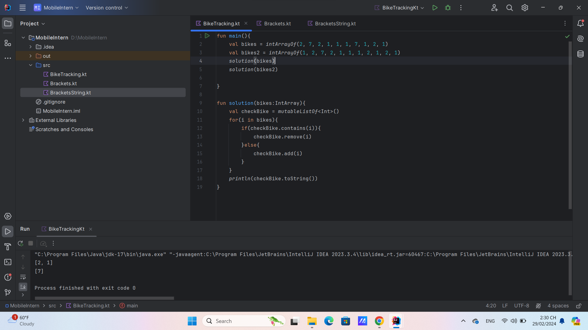
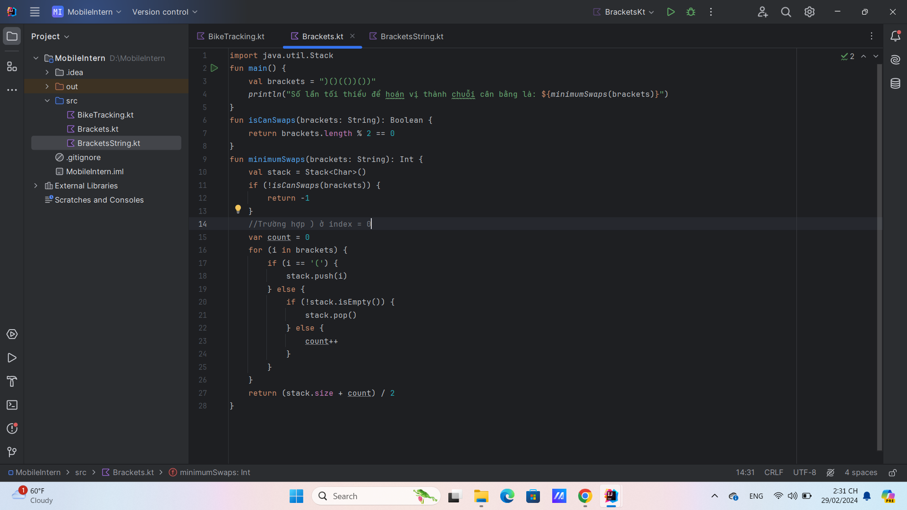
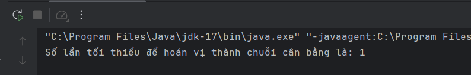
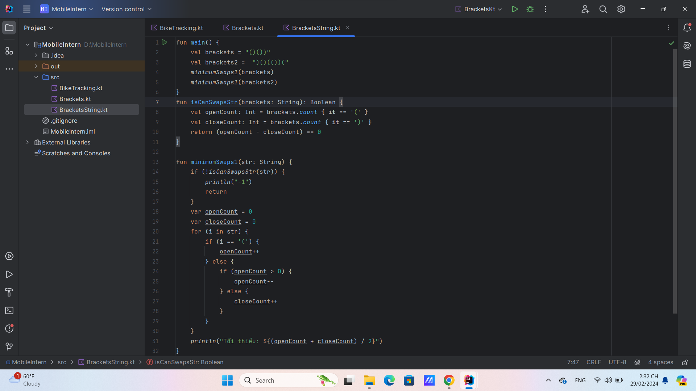
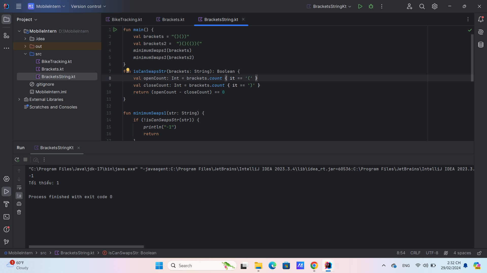

# Mobile Intern
*Nguyễn Văn Phúc*

### 1. Bike Tracking
> Sử dụng List để chứa các phần tử đã được duyệt
> Nếu phần tử tại vị trí thứ i đã tồn tại trong list => tức là phần tử đang xét hiện tại đã được trả => remove
> Ngược lại, không có tức là xe đó được kiểm tra nên lưu vào list

```kotlin
fun main(){
    val bikes = intArrayOf(2, 7, 2, 1, 1, 1, 7, 1, 2, 1)
    val bikes2 = intArrayOf(1, 2, 7, 2, 1, 1, 1, 2, 1, 2, 1)
    solution(bikes)
    solution(bikes2)
}
fun solution(bikes:IntArray){
    val checkBike = mutableListOf<Int>()
    for(i in bikes){
        if(checkBike.contains(i)){
            checkBike.remove(i)
        }else{
            checkBike.add(i)
        }
    }
    println(checkBike.toString())
}

```




### 2.Balance Parentheses with Stack
>Ban đầu sẽ kiểm tra dữ liệu đầu vào có thể là 1 chuỗi cân bằng hay không
>Sử dụng stack để lưu các kí tự mở "(" 
> Nếu là kí tự đóng thì sẽ remove "("
> + Nhưng nếu stack rỗng thì sẽ bị lỗi nên cần kiểm tra nếu có kí tự "(" thì mới xóa
> + Tránh sai dữ liệu kiểm tra khi dấu đóng ở vị trí đầu, hoặc stack rỗng nên sử dụng thêm biến count
> kết quả  = (số ngoặc đóng + số ngoặc mở) / 2

```kotlin
import java.util.Stack
fun main() {
    val brackets = ")()(())())"
    println("Số lần tối thiểu để hoán vị thành chuỗi cân bằng là: ${minimumSwaps(brackets)}")
}
fun isCanSwaps(brackets: String): Boolean {
    return brackets.length % 2 == 0
}
fun minimumSwaps(brackets: String): Int {
    val stack = Stack<Char>()
    if (!isCanSwaps(brackets)) {
        return -1
    }
    //Trường hợp ) ở index = 0
    var count = 0
    for (i in brackets) {
        if (i == '(') {
            stack.push(i)
        } else {
            if (!stack.isEmpty()) {
                stack.pop()
            } else {
                count++
            }
        }
    }
    return (stack.size + count) / 2
}
```

 

 

### 3.Balance Parentheses with String
>Tương tự như trên
>Sử dụng hàm có sẵn count để đếm số ngoặc đóng và mở có đáp ứng được yêu cầu cân bằng hay không

```kotlin
fun main() {
    val brackets = "()())"
    val brackets2 =  ")()(())("
    minimumSwaps1(brackets)  //-1
    minimumSwaps1(brackets2)  //1
}
fun isCanSwapsStr(brackets: String): Boolean {
    val openCount: Int = brackets.count { it == '(' }
    val closeCount: Int = brackets.count { it == ')' }
    return (openCount - closeCount) == 0
}

fun minimumSwaps1(str: String) {
    if (!isCanSwapsStr(str)) {
        println("-1")
        return
    }
    var openCount = 0
    var closeCount = 0
    for (i in str) {
        if (i == '(') {
            openCount++
        } else {
            if (openCount > 0) {
                openCount--
            } else {
                closeCount++
            }
        }
    }
    println("Tối thiểu: ${(openCount + closeCount) / 2}")
}
```

 

 